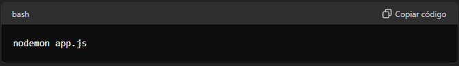
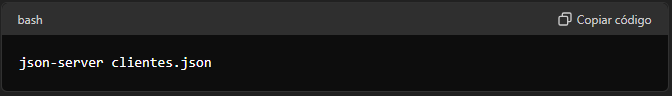

# Sistema Básico de Cadastro em Node.js 🚀

Este projeto é um sistema simples de cadastro que realiza operações CRUD (Criar, Ler, Atualizar e Deletar) utilizando Node.js.

## ➡️ Funcionalidades do Código

1. **Home** :      /
2. **Cadastrar** : /cadastrar
3. **Editar** :    /editar
4. **Deletar**:    /remover

## ➡️ Instalação 

Siga os passos abaixo para configurar e executar o projeto:

1. **Frontend:**

- Acesse a pasta front via terminal.
- Execute o seguinte comando:

2. **Backend:**

- Acesse a pasta back via terminal.
- Execute o seguinte comando:

